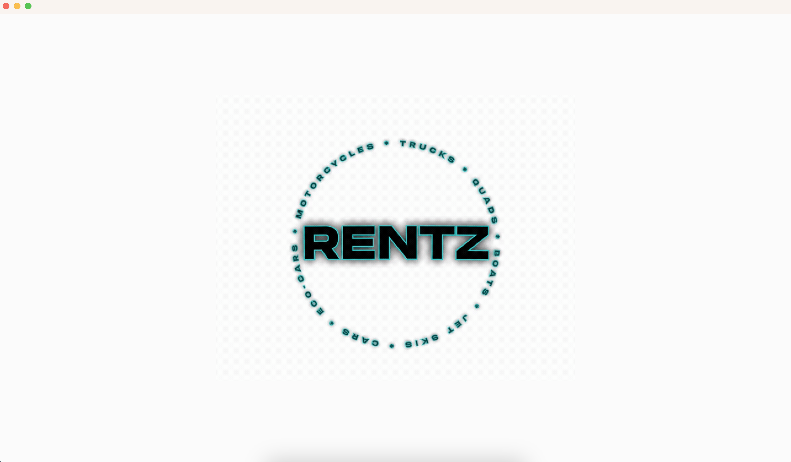

[](https://www.linkedin.com/in/rsalas3000)
`Rsalas3000`, `Rentz_vehicle_rental_system`, `linkedin_username == Rsalas3000`, `rsalas3000@gmail.com`


<!-- PROJECT LOGO -->
<br>
<div align="center">
  <a href="https:www.github.com/rsalas3000/Rentz_vehicle_rental_system"></a>
  
<p align="center">Welcome to the ReadMe section of the project I created..</p>


<p align="left">
  The project in its entirety can be described as a vehicle rental system with a slight twist,
  where members can help themselves rent from a variety of vehicles, including motorcycles,
  quads, boats, jet skis, and more. All within a super user friendly interface. To fully experience
  the program's functionality, feel free to create multiple accounts.
<br />
  <a href="https:www.github.com/rsalas3000/Rentz_vehicle_rental_system"><strong>explore the docs</strong></a>
</p>
</div>

<!-- TABLE OF CONTENTS -->
<details>
  <summary>Table of Contents</summary>
  <ol>
    <li>
      <a href="#about-the-project">About The Project</a>
      <p align="left">
       Rentz started as a vehicle rental system with a single administrator assisting clients in
        choosing their preferred vehicle. As the service industry embraces self-service models, I felt it
        would be a great idea for the clients to have things in their own hands from start to finish. Thus leading to a self-service vehicle rental system, Rentz.
      </p>
      <ul>
        <li><a href="#built-with">Built With</a></li>
      </ul>
    </li>
    <li>
      <a href="#getting-started">Getting Started</a>
      <ul>
        <li><a href="#prerequisites">Prerequisites</a></li>
        <li><a href="#installation">Installation</a></li>
      </ul>
    </li>
    <li><a href="#usage">Usage</a></li>
    <li><a href="#roadmap">Roadmap</a></li>
    <li><a href="#contributing">Contributing</a></li>
    <li><a href="#contact">Contact</a></li>
    <li><a href="#acknowledgments">Acknowledgments</a></li>
  </ol>
</details>

<!-- ABOUT THE PROJECT -->
## About The Project
<p>
Rentz started as a vehicle rental system with a single administrator assisting clients when
choosing their preferred vehicle. As the service industry shifts embraces self-service models, I felt it
would be a great idea for the clients to have things in their own hands from start to finish.
Thus leading to a self-service vehicle rental system, Rentz.
</p>
<br />
<p align="right">(<a href="#readme-top">back to top</a>)</p>


### Built With

* [](https://www.java.com/)

<p align="right">(<a href="#readme-top">back to top</a>)</p>

<!-- USAGE EXAMPLES -->
## Usage

<br/>
<div align="center">
  
  <h3 align="center">The Introduction</h3>
  
  <a href="https://github.com/rsalas3000/Rentz_vehicle_rental_system">
    
  </a>
<p>
To begin, Rentz introduces itself with a fun and gentle animation with sound, showcasing all the types of vehicles available for rent, circling
  the name Rentz. After the animation is done it proceeds to a sign-up and authentication process.
</p>
<br />
<h3 align="center">Sign-up and Sign-in</h3>

  <a href="https://github.com/rsalas3000/Rentz_vehicle_rental_system">
    
  </a>
<p>
<div align="left">
This sign-up and authentication process is nothing different from the average. If your new to Rentz then you hit the 'new account?' button,
otherwise members go ahead and put their matching username and password to proceed. All registered users are written to the registeredusers.txt, this is where
members are recorded thus allowing the rental process to continue. There is also a usersandcurrentrental.txt where there is a list of current rentals of each
and every user, this allows the system to update which vehicles are available and which are not. Once authentication is acquired, members are then steered to 
the selection page where they are then able to start with the selection process.
</p>
<br />
<h3 align="center">Vehicle Information, Selection and Drop-off</h3>

  <a href="https://github.com/github_username/repo_name">
    
  </a>
<p>
  <div align = "left">
The rental process is a simple one, select the type of vehicle your searching for by pressing one of the 7 animated button. Selection consist of 7 different types of
vehicles.
<div />
<a> 
<div align = "center">
  
   `car` 
    

   `eco-car` 


   `truck` 


   `motorcycle` 


   `quad` 


   `boat` 


   `jet ski` 

<div align = "left">
After selecting your preferred vehicle, simply press the 'Rentz' button. With its user-friendly interface, members can navigate effortlessly.
Each vehicle possesses its own class, extending from the parent class AbstractVehicle.java.
  <div>
<br />


<p>There are several components to the information GUI, they consist of the following:</p>
    <ul>
      <li> The category button panel</li>
      <ul>
      <li> There are a total of 7 buttons in the north panel each representing the type of vehicle the member wants to select.</li>
      <li>The types consist of car, eco-car, truck, motorcycle, quad, boat, and jet ski.</li>
      </ul>
      <br>
    <li> The vehicle selection list</li>
      <ul>
      <li>This text area, which is west of the frame, is used for selecting the vehicle you may want to rent; once selected, information is prompted in the information text box.</li>
      </ul>
    <li> The information text box</li>
      <ul>
      <li>Used for displaying retrieved description data pertaining to the vehicle selected from the vehicle selection list.</li>
      </ul>
    <li> The Tabbed panel</li>
      <ul>
      <li>The users current Rental box</li>
        <ul>
       <li> Displays a vertical list of current rentals of the current user.</li>
        </ul>
      <li>The Rentz button</li>
        <ul>
       <li> When pressed a continuation of prompts occur then leading to a bill for the user.</li>
        </ul>
      <li>The Dropz button</li>
        <ul>
       <li> After selecting the vehicle you want to drop off, this button when press returns the vehicle to the inventory.</li>
        </ul>
      <li>The login/log out button</li>
       <ul>
         <li> After pressing, your able to go back to the login page, also considered a log out button.</li>
       </ul>
      </ul>
    </ul>
</a>
</p>
</div>
<p align="right">(<a href="#readme-top">back to top</a>)</p>

### Installation 

1. Open your terminal.
2. Navigate to the directory where you want to clone the repository.
   ```sh
   cd path/to/your/directory
   ```
3. Use the 'git clone' command followed by the URL of the GitHub repository to clone it to your local machine. 
   ```sh
   git clone https://github.com/Rsalas3000/Rentz_vehicle_rental_system.git
   ```
4. Press Enter. Git will download the entire project from the GitHub repository and create a new directory with the project name in your current directory.

   Once the cloning process is complete, you'll have the project downloaded and ready to use in the specified directory on your local machine.

<p align="right">(<a href="#readme-top">back to top</a>)</p>


